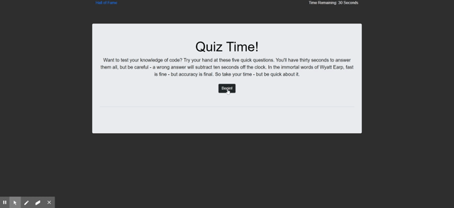

# codeQuiz

## Description

An interactive, dynamic, fun way for programming students to test their knowledge of basic coding principals in a timed, multiple choice format. With a clean, easy to navigate interface, Code Quiz gives clear, live feedback to students as they progress, allowing them to compare their score to that of their peers once the game is done. Code Quiz is made using dynamic javascript and styled using Bootstrap, making it responsive across multiple devices.

## Features:

- Responsive, easy to navigate layout, making the test easy to read and easy to use
- Live feedback in both written and audio formats; contestants know where they stand throughout the quiz
- Persistant score tracking; students can track their progress against their peers.

## Installation:

- Code can be cloned for deployment on an intranet server, or downloaded for local use.

## Site Demo:

## Link to Deployed Site:

[Deployed App](https://puentebravo.github.io/codeQuiz/)

## Credits:

This project wouldn't be possible without the continued guidance of my Instructors at the Columbia University Coding Bootcamp. Particular thanks are due to my TA, Andrew Bautista, whose instruction was invaluable to the completion of this application. As always, profuse thanks are due to my incredible study group, whose continuing aid ensured not only the quality but the functionality of this project. We got this, y'all!

## License:

Content is governed by the Creative Commons Legal Code, spelled out in the included LICENSE file.

---

Copyright [2020] [Charlie Puente]
